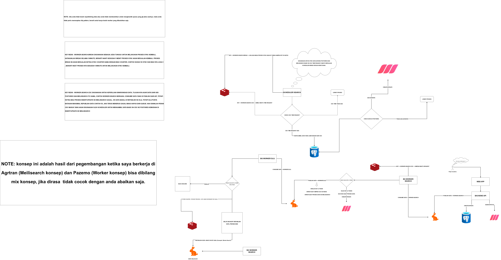
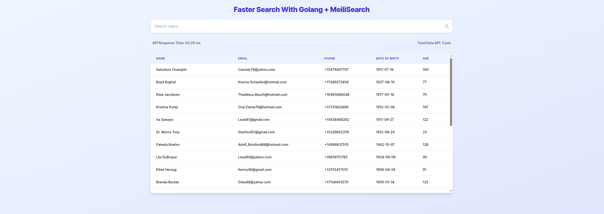
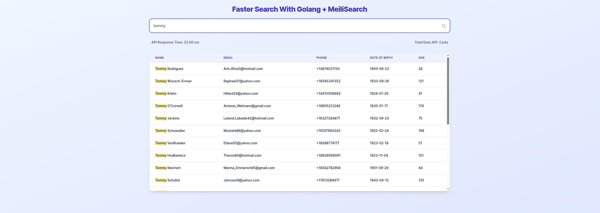

# Fast Search Implementation with Golang + Meilisearch and FullStack Monorepo

This project is a simple backend API implementation using Golang to support fast search on large datasets utilising Meilisearch. In the development of this API, several design patterns are applied, including the CQRS Pattern, CDC Pattern, Background Worker Pattern, and scheduled data synchronisation between Meilisearch and Postgres. It is hoped that this tutorial can provide benefits and solutions for those of you who are facing challenges in managing large amounts of data. The concepts presented are highly suitable for applications such as online stores, travel applications, retail, and similar systems.

## What You Can Learn from This Repository?

- [x] CQRS Pattern
- [x] Background worker processing
- [x] Background scheduler processing
- [x] CDC Pattern
- [x] Concurrency pattern: Worker Pool & Pipeline
- [x] Fullstack Monorepo setup
- [x] Message broker authorization
- [x] Live reload for Golang development
- [x] Docker monorepo setup
- [x] Melilisearch setup
- [x] Backoff locking with Redis
- [x] Clean architecture setup for complex projects

## Instructions for Running the Application

- ### Docker

    + #### Building Docker
    ```sh
        make upb; make up
    ```
    + #### Stopping Docker
    ```sh
        make down
    ```

- ### Application

   + #### Installing Dependencies
    ```sh
        make dev | make worker | make cron
    ```
   + #### Running the Application
    ```sh
        make dev | make worker | make cron
    ```
   + #### Building the Application
    ```sh
        make build
    ```


## System Design Architecture



## Application Screnshoot


